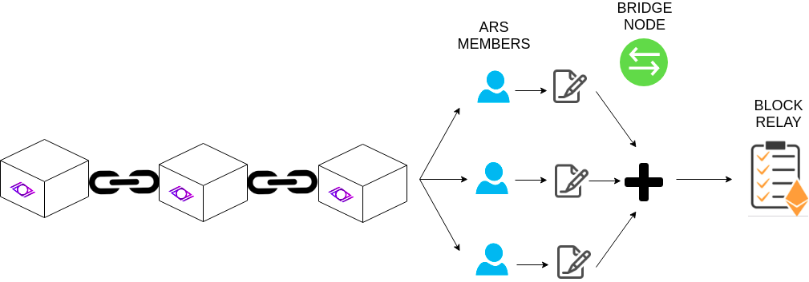
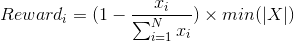

# Block Relay in Witnet

The Witnet Bridge Interface (WBI) is a core component of the Witnet protocol as it enables the communication between the smart contracts in Ethereum and Witnet. In order to trustlessly verify transactions included in a Witnet block, the Ethereum smart contract needs to be able to perform verifications of the so called Proofs of Inclusion (PoI). Assuming all Witnet block headers are available to the WBI, a bridge node simply needs to provide the merkle path that includes the transaction to be verified and that reaches the root in the block header.

Obviously the aforementioned mechanism works just because we assumed the block header is available in the WBI. How to make this possible with a non PoW/PoS chain is a more challenging concern though. Without loss of generality, we will assume that the WBI has access to the Witnet block headers because they are stored in another contract in Ethereum that is called the **Block Relay**. We will focus thus on how these blocks are reported to the block relay.

As with the WBI, only bridge nodes have access to both Witnet and Ethereum chains. Thus, bridge nodes should be in charge of reporting valid blocks that will later be used to verify PoIs in the WBI. We observe three main challenges:

- **Integrity of the Block header**: the reporting protocol needs to guarantee the integrity and validity of the block header reported.
- **Economic incentives**: the reporters should be economically incentivized to post correct block headers in the Block Relay contract.
- **Chain reconciliations**: the Block Relay should be able to recover from chain reconciliations in which the tip of the chain changed or was wrongly reported.

## Block Header Integrity: the problem

Recall Witnet does not feature a PoW nor PoS consensus mechanisms, but rather it utilizes cryptographic sortition with biased probabilities depending on past behavior. The trustlessness property is thus more difficult to achieve as we cannot simply look at the chain with the longest amount of work. We could simply let all bridge nodes report what they consider the latest valid block. The problem with this approach is that is easily sybileable, and it could lead to the following security concerns:

1. Imagine an attacker controls half plus one bridge nodes from the entire bridge node set. In this case, she can insert whatever header is more convenient to her.
2. She can preconstruct a header including a result of a data request of her interest that was previously posted to the WBI. She can even make up a beneficial Active Reputation Set (ARS) and report it with the header. She reports the block header to the Block Relay contract, which accepts it by majority.
3. She later constructs a PoI for the header she inserted in the block relay, aiming at verifying the result of her interest.
4. The WBI accepts it and stores it as the result to the data request, while the true result remains unreported.

The aforementioned problem stems from the fact that the blocks reported by non-reputed sybil bridge nodes were accepted as valid candidates. As the consensus in Witnet is decided through the reputation system, it is expected that the block relay also needs to utilize such information in some way to achieve a higher degree of security. We can expect that information can be inserted in the block relay reported as, e.g., the merkle root of all ordered reputation scores, and later prioritize based on the score they hold in the reputation set. The first thing to note is that the efficiency of this approach is rather low, as to demonstrate its membership to a position in the reputation set each of the reporters would need to sign the block, making the verification costly in Ethereum. Second, the most reputed node could report any block header of its convenience, and it would still be successful. Third, as the number of identities increases the proof of membership to the reputation set also becomes more expensive in Ethereum. These challenges can be solved in the following way:

- In order to offer a more efficient approach, we can randomly select a subset of bridge nodes that will be reporting the block headers.
- We should avoid trusting a single entity, even if it is a high reputed one. As such, there needs to be some kind of agreement/consensus between several reporters.
- In order to enhance participation in the Witnet protocol and reduce the potential depth of a PoI verification in the bridge, we can merklelize only the ARS instead of the whole set. Thus, we can select a subset of the last ARS who will be in charge of reporting block headers.
- The ARS is limited with respect to the velocity of the Witnet network. The more data requests are inserted, the more members will be in the ARS.
- The ARS will likely contain active nodes with rather high reputation, and thus we can assume they will have an interest on being honest.

## Proof of Membership

In this section we formally define Proof of Membership, i.e., the ability of a Witnet node to demonstrate it was part of the ARS at a specific point in time. In order to provide this capability, we need the inclusion of the merkle root of the Active Reputation Set (ARS). The leaves are the public keys of those members in the ARS. Remember that the ARS is defined as the participants that have been actively working for the Witnet network, in the form of witnessing or mining, in the last N epochs (where N is a protocol parameter). As such, if a Witnet node needs to prove its membership to the ARS at a specific point in time it needs to provide:

- A challenge signed with the private key corresponding to the public key the node claims to be associated with.
- The public key itself.
- The merkle path (siblings) that lead to the ARS merkle root at a specific point in time.
- The point in time at which it is claiming to be part of the ARS.

A proof of membership is composed of sigma = (C, Sig( C ), PK, Merklepath, epoch). In practice the challenge can just be the concatenation of the beacon plus the address of the sender.

In order to verify the validity of the proof of membership, the verifier needs to have access to the block header of the epoch at which the prover is claiming to be part of the ARS. If so, the verifier:

1. Verifies that the public key and the siblings lead to the merkle root provided
2. Verifies the signature to check that the prover is indeed in possesion of the corresponding private key.

## Relaying blocks

We divide the process of relaying blocks in different phases to be implemented in the process of building a decentralized efficient block relay. However, each of the phases will share the API to which bridge nodes connect, aiming at offering the most ergonomic updating process to the bridge nodes.

### Stage 1: ARS voting

Stage 1 requires the ARS members to vote for the correct block hash candidate in the block relay. This is, all nodes interested on the healthiness of the system need to run both an Ethereum client and a Witnet node to become witnesses and bridge nodes at the same time. 

In this case, the block hash candidate that received more votes from the ARS is the one that is consolidated. As said before, we expect the ARS members to be those that have higher reputation and in consequence to be those more interested in having a good block relay.

The main drawbacks in this stage are obvious. First, the fact of having to run both the Ethereum client and the Witnet node. Second, if an attacker inserts quite a few of data requests she can introduce a bunch of her potentially sybil identities in the ARS. In this particular case, she can obtain majority in the voting of the block hash tip. These problems get solved in future stages.

### Stage 2: weighted ARS voting

In this stage, the influence on the voting of the block header hash is weighted according to the reputation that ARS members have. However, in order to avoid the situation in which a single identity can heavily influence the voting, we can instead weight votes by the position they hold in the ARS. For instance, one could make sure that the first 25% copes with the remaining 75% of the ARS. This way, in order to influence the voting a potential attacker needs to influence the top 25% or the lower 75% of the ARS. Further, an attacker not only needs to place more than 50% of identities in the ARS but rather she also needs to become either the top reputed entities.

### Stage 2.5: collateralized voting (?)

Additional to previous stages, the voting scheme may include a collateral in order to increase the incentives of being honest. Those behaving dishonestly (i.e. reporting fake block headers) will lose their collateral, which may be distributed among honest reporters or even be burned.

### Stage 3: BLS signatures

The aforementioned approach has a big drawback: witnesses need also to act as bridge nodes to ensure the security of the protocol. A different proposal might be that the voting is based on aggregated signatures(BLS). In this case, ARS nodes could just send the last header they know about signed with BLS, and the bridge node would just need to aggregate those signatures. With BLS signatures, it would only take one verification in the block relay contract to verify all the aggregated signatures from the ARS. At this stage, VRFs in the WBI would still be performed with the curve secp256k1, but `LAST_BEACON` messages would be signed with BLS. In addition, BLS signatures are subsidized in Ethereum (?), thus reducing further the cost.

https://crypto.stackexchange.com/questions/53509/can-the-precompiles-in-ethereum-byzantium-for-pairings-be-used-for-implementation

https://ethresear.ch/t/pragmatic-signature-aggregation-with-bls/2105

<em>Fig. 1: Signature aggregation and its posibilities for the block relay</em>

### Stage 4: replace VRF by BLS

[To be completed after assessment]

As aforementioned, stage 3 requires BLS signatures by Witnet nodes. Taking into account that BLS signatures are deterministic, there is a clear opportunity of using BLSs instead of VRFs for computing Proof of Eligibilities (PoEs). This is possible due to the fact that PoEs have fixed inputs for all participating nodes (e.g. data request identifier and beacon).

However, before replacing VRF with BLS, it is required to perform a further analysis about the following topics and concerns:

- Efficiency of BLS compared to VRF, both in Witnet nodes and Ethereum Smart Contracts (EVM).
- Assessment of potential changes in the Witnet, both in the Witnet transaction model (e.g. commit transactions).
- Assessment about potential impacts in the P2P network, more specifically in the `LAST_BEACON` message exchanges among peers.
- Assess maturity of BLS (e.g. pairing functions) in terms of crypto analysis (e.g. known attacks and vulnerabilities).

### Stage 5: dispute resolution (?)

[To be completed]

Things to do:

- Assess if dispute mechanism if required
- Assess how the Block Relay could recover from a fork

## Economic Incentive: fee as low as possible

Another aspect that the block relay needs to cover is the fact that nodes will have an economic incentive to report blocks, and they should not be able to set the fee as high as to make the data request non-executable. In order to cope with that we propose an inverse auction: the lowest price reported by a bridge node is the one that is set as the fee. However, we still reward all bridge nodes that participated in the correct block header consensus reporting. We apply proportionality as to how deviated the reports were with respect to the minimum. Let's work through an example:

- Imagine both Alice and Bob report the same correct block header to the block relay.
- Alice sets a report reward fee of 1 ETH, while Bob sets the fee as 9 ETH.
- In this case, 1 ETH is established as the block report reward, of which 0.9 will go to Alice and 0.1 to Bob.

With that in mind the reward that each node would obtain for someone whose reported block was successfully utilized in a PoI verification is:

<em>Eq. 1: Reward for each of the block header reporters</em>

where |X| = x1, x2, ..., xN and each xi is the value proposed by selected node i.

With this scheme all nodes are incentivized to set the fees as low as possible in favor of price competition. Ideally, all bridge nodes would set it low enough (taking into account the transaction gas and potential benefit derived from the WBI) so that they get an equal share of the rewards.

## Borrar?

#### Disputes

The next question is how do we dispute a potential fork of two block headers. This can be done by considering the ARS before the fork, and consolidate the block header that was supported/extended by more members of that ARS. In this case, the attacker would need to monopolize/bribe a majority of the ARS, e.g., perform a playbook attack, in which case she already can flip the result of a data request. In this case we define a dispute period of l, after which the block is considered consolidated. Of course, the validity of a block at time t needs to be voted and validated by those in the ARS of the preceding block (vuelta de tuerca). (the random number serves for all?). Maybe as Ethereum has 4 epochs compared to Witnet, we can use those 4 iterations to select N different ARS participants on each. These could actually stake some amount that will be slashed if the reported block does not become final.

The aforementioned approach has a big drawback: witnesses need also to act as bridge nodes to ensure the security of the protocol. Although our first version might include such a drawbackf, a different proposal might be that if there is a fork, due to a malicious block reported, reconciliations can be performed based on aggregated signatures or reporting (BLS).  For instance, if the correct block in the fork can be backed up by as many nodes in the previous ARS as possible by signing it. With BLS signatures, it would only take one verification in the block relay contract to verify all the aggregated signatures from the ARS. However, this involves changing the curve in the Witnet protocol as well as the VRF verification, something that should be thought carefully.
